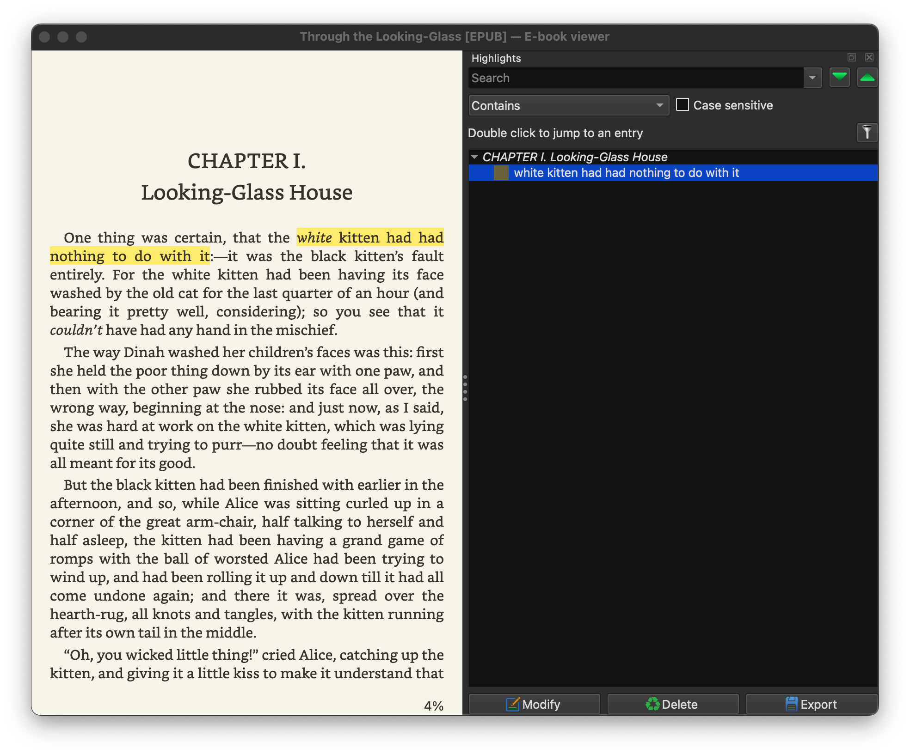

# koreader-to-calibre-highlights

Import your KOReader highlights into Calibre

**WORK IN PROGRESS. THIS MAY DAMAGE YOUR CALIBRE DATABASE. USE AT YOUR OWN RISK. MAKE A BACKUP OF YOUR CALIBRE LIBRARY FIRST.**

Adding highlights in KOReader is good while you actually read a book.
For post-processing (say, creating flashcards for Anki), however, it's way easier to do that on your computer in Calibre (which you will probably use for managing your books, anyway).

**Highlight in KOReader** (e.g. on your e-reader)


**Highlight in Calibre** (on your computer)


## Usage

Make sure Calibre is installed and the `calibre-debug` command is available in your `$PATH`. You e-reader must be connected to your computer and mounted as directory.

```
usage: calibre-debug -e "main.py" --- [-h] koreader_calibre_metadata_path calibre_library_path

Import KOReader highlights into Calibre

positional arguments:
  koreader_calibre_metadata_path
                        Path to .metadata.calibre on your KOReader device
  calibre_library_path  Path to your Calibre library

options:
  -h, --help            show this help message and exit
```

# How it works

The Python scripts reads your Calibre metadata on your KOReader device, searches for sidecar files and annotations in it, transforms them to the Calibre format and then imports them into your Calibre library by using the official Calibre Python API.

Technically we transform the XPath based KOReaders to the Calibre CFI format it uses for highlights. To do that we need to access the actual EPUB files in your Calibre library.

It only works for EPUB files, not for PDF or other formats. The script will only import highlights from EPUB files. If you have other formats in your library, they will be ignored.

# What doesn't work yet

Not all highlights are support right now. Some XPath expressions are not supported yet.

The so called `toc_family_titles` attribute is also not correctly handled yet.
It will only use the chapter as found in the KOReader sidecar file.
Calibre seem to have no problem with that, though.

# Acknowledgements

Some ideas are takes from the excellent https://github.com/harmtemolder/koreader-calibre-plugin.

Originally I forked the plugin to implement the functionality in there, but I later decided to first to it in a standalone script.

I still hope we can bring this functionality to the plugin, but I don't have the time to do that right now.

This script also uses https://github.com/SirAnthony/slpp to parse the KOReader sidecar Lua files.
